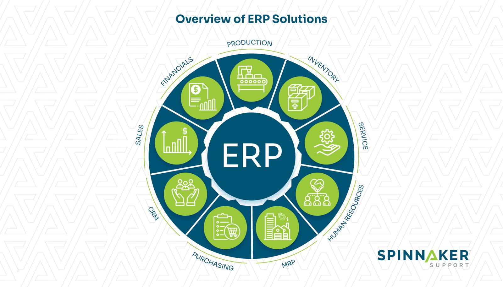

# Module 1 Challenge: AI Case Study: SAP SE

SAP SE is a German multinational software company based in Walldorf, Baden-Württemberg, Germany. It develops enterprise software to manage business operation and customer relations. The company is the world's leading enterprise resource planning software vendor [[2]](#2) ([Wikipedia SAP](https://en.wikipedia.org/wiki/SAP)).
Founded in 1972, SAP is a large incumbent technology company that is doing something interesting with new, emerging AI technology as a way of increasing revenues and gaining market share.

According to Ted Rohm (Senior ERP Analyst) [[1]](#1) ([How AI Is Transforming Enterprise Resource Planning](https://www3.technologyevaluation.com/research/article/how-ai-is-transforming-erp.html)):

> “The use of AI in ERP will radically change the way business data and processes are managed. ERP systems will no longer require people’s efforts and intelligence to properly code
> and enter every minute detail of a business transaction to complete an operation.
>
> Artificial Intelligence holds the promise of further freeing people from many tasks that require human intelligence to make them happen.”

## Overview and Origin

The below provides details of the company that were found in [[2]](#2) ([Wikipedia SAP](https://en.wikipedia.org/wiki/SAP))

* Name of company

    * SAP SE is a German multinational software company based in Walldorf, Baden-Württemberg, Germany. It develops enterprise software to manage business operation and customer relations. The company is the world's leading enterprise resource planning (ERP) software vendor.

* When was the company incorporated?

    * Founded in 1972 as a private partnership. In 2005, it further restructured itself as SAP AG. It has regional offices in 180 countries and over 111,961 employees.

* Who are the founders of the company?
    
    * Five IBM engineers from the AI department (Dietmar Hopp, Klaus Tschira, Hans-Werner Hector, Hasso Plattner, and Claus Wellenreuther, all from Mannheim, Baden-Württemberg) founded SAP.

    * In June 1972 they founded the SAP Systemanalyse und Programmentwicklung ("System Analysis and Program Development" / "SAPD") company, as a private partnership under the German Civil Code.

* How did the idea for the company (or project) come about? 

    * When Xerox exited the computer hardware manufacturing industry in 1971, it asked IBM to migrate its business systems to IBM technology. As part of IBM's compensation for the migration, IBM was given the rights to the Scientific Data Systems (SDS)/SAPE software repository.

    * The SAP founders were working on an enterprise-wide system based on this software, only to be told that it would no longer be necessary. Rather than abandoning the project, they decided to leave IBM Tech and start another company.

* How is the company funded? How much funding have they received?

    * SAP SE is a large listed company and funding for their AI projects is made available from their revenues.

    * Details on the investment level for AI is not publically available.

## Business Activities

* What specific problem is the company or project trying to solve?

    * SAP provides software solutions in the areas of [[3]](#3) ([SAP, n.d.](https://www.sap.com/about/company.html)):
        * Enterprise Resource Planning (ERP)
        * Supply Chain Management
        * Financial Management
        * Spend Management
        * Human Capital Management
        * CRM and Customer Experience

* Who is the company’s intended customers? Is there any information about the market size of this set of customers?

    * The SAP solutions listed above are targeted at a number of different industries including [[3]](#3) ([SAP, n.d.](https://www.sap.com/about/company.html)):
        * Automotive
        * Banking
        * Consumer Products
        * Oil, Gas and Energy
        * Retail

    * SAP provides software solutions as both on premises and SaSS (software as a service solutions). The SAP SaSS platform has over 280mm+ cloud users. SAP had revenues of €29.52bn in the 2022 financial year. It has 105k employees in 157 countries. [[3]](#3) ([SAP, n.d.](https://www.sap.com/about/company.html))

* What solution does this company offer that their competitors do not or cannot offer? (What is the unfair advantage they utilized?)

    * According to the SAP Community blog, the SAP Cloud is the real differentiator for SAP. [[4]](#4) ([Community, n.d.](https://community.sap.com/t5/technology-blogs-by-sap/sap-saas-applications-what-you-need-to-know/ba-p/13439695))
    * _SaaS_ is the delivery of applications over the internet (or “in the cloud”) with no need to install, maintain or host software on site. Users simply access applications via the cloud as a subscription service.

* Which technologies are they current using, and how are they implementing them?
    
    * With SAP, companies of all sizes can run their entire business in the cloud from a single, integrated platform. And because (they) offer public, private and managed cloud solutions, (their) customers can start anywhere and go everywhere in the cloud, depending on their business need.

    * SAP also recognized the need to complement (their) own applications with best-in-class public cloud _SaaS_ solutions for the most critical lines of business. And they did this through recent key acquisitions that include Ariba, Concur, Fieldglass, and Success Factors.

## Landscape

* What field is the company in?

    * As detailed above, SAP is an ERP solution provider active in a number of different business areas and supporting enterprise planning in those businesses.   

* What have been the major trends and innovations of this field over the last 5-10 years?    

    * There have been several major trends in ERP solutions over the last 5-10 years [[5]](#5) ([Spinnaker, n.d.](https://www.spinnakersupport.com/blog/2023/10/18/10-erp-trends-to-watch-innovations-in-business-management/#:~:text=The%20two%2Dtier%20ERP%20trend%20will%20offer%20value,and%20more%20adaptable%20to%20changing%20business%20needs)):
    
        

    * Cloud based ERP solutions
    * Hyperautomation with AI and machine learning
    * IoT and ERP convergence
    * Mobile ERP accessibility
    * Industry-specific customizations
    * Personalized and collaborative ERP
    * Predictive and advanced analytics
    * Two-tier ERP
    * Composable ER
    * ERP and sustainability

* What are the other major companies in this field?

    * SAP has a number of major competitors. The top 10 ERP vendors are: [[6]](#6) ([CIO.com, n.d.](https://www.cio.com/article/304902/10-most-powerful-erp-vendors-today.html)):
    
        * SAP: Restructuring to target AI
        * Microsoft: Powerful integration of genAI features
        * Oracle: Two-headed ERP business (Oracle Fusion cloud, Oracle Netsuite)
        * Infor: Industry-specific solution
        * Workday: Managing human capital
        * Epicor Software: Focusing on ‘cognitive ERP’
        * IFS: Manufacturing innovation
        * Sage: Accounting and finance for SMBs
        * Acumatica: A modular approach to cloud ERP
        * QAD: Manufacturing and supply chain innovation
    
## Results

* What have been the business impact of this company so far?

    * The most significant innovation that SAP has introduced in recent years is an AI solution known as Joule which is a key part of their Business AI. This solution is only available on their cloud-based offerings and it has increased sales by moving customers off the on premises solution on to the cloud based offerings.
    * With SAP Business AI, users are empowered to interact with SAP software in the most natural way possible through Joule – SAP’s copilot available across SAP applications. Hundreds of millions of users will be more efficient and more productive through simply describing their ideas, asking analytical questions, or telling the system what to do rather than clicking through transactions or coding applications. SAP systems will understand what users mean, not just what they say. [[7]](#7) ([SAP, SAP Business AI whitepaper, n.d.](https://d.dam.sap.com/a/11HRxdm/SAP%20Business%20AI%20Whitepaper.pdf))
    * SAP Business AI enhances the capabilities of SAP applications enabling them to learn and improve business outcomes. This leads to significant improvements in key business processes like recruit to retire, source to pay, design to operate, and lead to cash – giving customers access to more intelligent and automated solutions.
    * To manage the new challenges that come with generative AI, SAP have introduced a Generative AI Hub on SAP AI Core. This will provide access to large language models and the required trust and control between SAP business processes and generative AI models. Integrating these assets into SAP’s proven AI services – which are already used by thousands of organizations – gives their customers the enterprise readiness that they expect.

* What are some of the core metrics companies in this field use to measure success? How is your company performing based on these metrics?   
 
    * They key metrics for a large listed company such as SAP are revenues, EBITDA (pre-tax earnings) and the impact that these have on its share price.
    * SAP’s investments in AI are translating into strong financial performance [[8]](#8) ([Chada, n.d.](https://www.linkedin.com/pulse/why-saps-share-price-increasing-because-ai-mahesh-chada-v6ync/)): 
    
    > "The efficiency gains and enhanced capabilities provided by AI-driven solutions are leading to increased adoption rates and higher sales. As a result, SAP is reporting robust revenue growth and profitability, which are key indicators of financial health that investors closely monitor. This positive financial performance drives up the share price." 

* How is your company performing relative to competitors in the same field?

    * Direct comparison of share price between SAP and its main competitors (Microsoft, and Oracle) is challenging because both of them have many divisions and their ERP solutions represent a small part of their businesses. However, it is possible to compare SAP to the Nasdaq index. In the last 52 weeks, SAPs share price high/low have been $221/$126 representing an appreciation of $95 per share (75%). In the same period the Nasdaq composite increased by a whopping 141% so SAP has performed well but the market overall has performed even better. (Data based on queries on the [Nasdaq website](https://www.nasdaq.com/market-activity/index/comp)). 

## Recommendations

* If you were to advise the company, what products or services would you suggest they offer?
* Why do you think that offering this product or service would benefit the company?
* What technologies would this additional product or service utilize?
* Why are these technologies appropriate for your solution?

    * SAP is the leader in ERP and their strategy of moving their solutions to the cloud and making them compostable allows enterprises of all sizes to benefit from their products. Even the smallest firms can subscribe to their _SaaS_ solutions and make use of them
    * The biggest challenge for a behemoth such as SAP is “moving the dial” when it comes to innovation. They have such a large share of the market that adding tens of thousands of cloud users does not materially change their revenue.
    * Innovation for SAP is therefore not just about gaining market share but about maintaining it. They have to innovate, move to the cloud and componentize their solutions so they can compete with Oracle, Microsoft etc.
    * Providing AI solutions for workflow, generation of reporting and forecasting is required so that they can stay in the game. 
    * My recommendation would that they continue to invest in AI solutions such as Joule and focus on providing more features and richer reporting using generative AI.
    * Generative AI as a technology is very suited to SAPs current technology stack. SAP has a large amount of good quality data available in the cloud and this can be used by LLMs to generate new content such as forecasting and financial planning and analysis (FP&A).

## Works Cited / References

<a id="1">[1]</a> [How AI Is Transforming Enterprise Resource Planning](https://www3.technologyevaluation.com/research/article/how-ai-is-transforming-erp.html)

<a id="2">[2]</a> [Wikipedia SAP](https://en.wikipedia.org/wiki/SAP)

<a id="3">[3]</a> [SAP, n.d. SAP. Retrieved from SAP:](https://www.sap.com/about/company.html)

<a id="4">[4]</a> [Community, n.d. SAP Saas Applications what you need to know. Retrieved from SAP Community:](https://community.sap.com/t5/technology-blogs-by-sap/sap-saas-applications-what-you-need-to-know/ba-p/13439695)

<a id="5">[5]</a> [Spinnaker, n.d. 10 ERP Trends to Watch: Innovations in Business Management. Retrieved from Spinnaker](https://www.spinnakersupport.com/blog/2023/10/18/10-erp-trends-to-watch-innovations-in-business-management/#:~:text=The%20two%2Dtier%20ERP%20trend%20will%20offer%20value,and%20more%20adaptable%20to%20changing%20business%20needs)

<a id="6">[6]</a> [CIO.com, n.d. 10 most powerful ERP vendors today. Retrieved from CIO.com:](https://www.cio.com/article/304902/10-most-powerful-erp-vendors-today.html)

<a id="7">[7]</a>  [SAP, SAP Business AI whitepaper, n.d. SAP Business AI whitepaper. Retrieved from SAP:](https://d.dam.sap.com/a/11HRxdm/SAP%20Business%20AI%20Whitepaper.pdf)

<a id="8">[8]</a> [Chada, n.d.  Why SAP's share price is increasing because of AI. Retrieved from Linked In pulse:](https://www.linkedin.com/pulse/why-saps-share-price-increasing-because-ai-mahesh-chada-v6ync/) 

        

